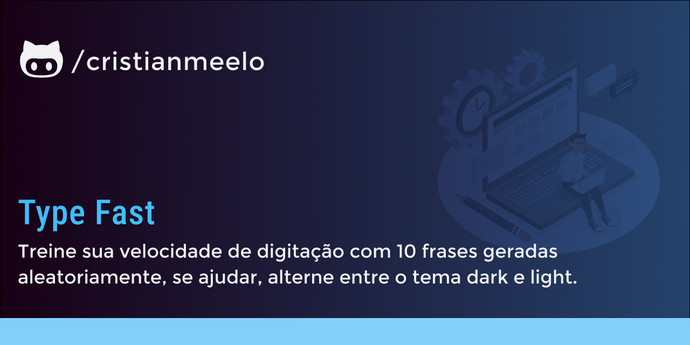
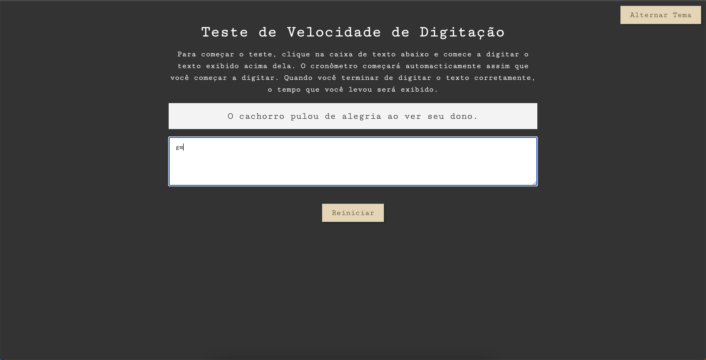

# TypeFast

TypeFast is a web application for you to train your typing speed! 

## 🔨 Project features

Typefast is a web application for you to train your typing speed. There are 10 randomly generated phrases that must be replicated in the input field, it is case sensitive, so be careful! Upon completing the phrase challenge, a local history of your speed is maintained. Challenge yourself, or someone else!

The [Tutorial of this application you can find here](https://www.youtube.com/watch?v=MOsJdRmQoko&ab_channel=MatheusBattisti-HoradeCodar).

## ✔️ Techniques and technologies used

Check out this list of everything we will use in this app:

- `html`
- `css`
- `JavaScript`
- `GitHub`

## 🛠️ Open and run the project

To open and run the project, add the Live Server extension, click on the Go Live button usually located in the lower right corner if you are using vscode.

Then go to http://127.0.0.1:5500/ in your browser.

## 📚 More course information

TypeFast is a web application developed from the [Matheus Battisti ](https://www.youtube.com/@MatheusBattisti) tutorial. The main idea of ​​this tutorial implementation is to further evolve knowledge in Javascript and a fun game, challenging something out of the ordinary. Monetarily, with this base idea, something like this [app can be created](https://www.ratatype.com.br/).
