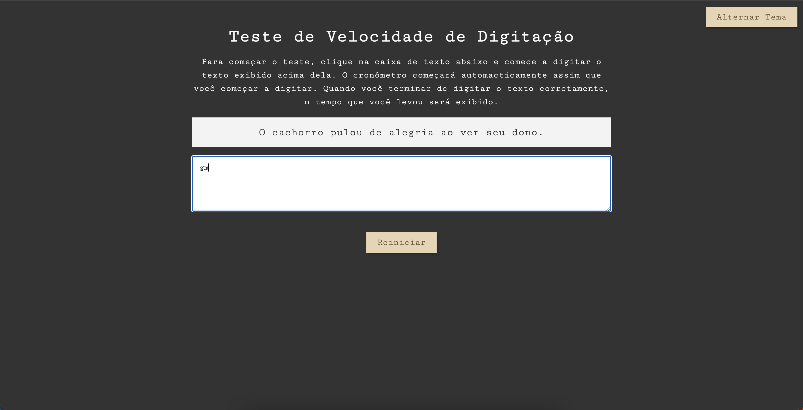

<table align="right">
  <tr>
    <td>
      <a href="README-en.md">🇺🇸 English</a>
    </td>
  </tr>
  <tr>
    <td>
      <a href="README.md">🇧🇷 Português</a>
    </td>
  </tr>
</table>

# TypeFast

TypeFast é um aplicativo web para você treinar sua velocidade de digitação! 

## 🔨 Recursos do Projeto

Typefast é um aplicativo da web para você treinar sua velocidade de digitação. Existem 10 frases geradas aleatoriamente que devem ser replicadas no campo de entrada, diferencia maiúsculas de minúsculas, portanto, cuidado! Ao completar o desafio de frase, um histórico local de sua velocidade é mantido. Desafie a si mesmo, ou a outra pessoa!

O [Tutorial deste aplicativo você encontra aqui](https://www.youtube.com/watch?v=MOsJdRmQoko&ab_channel=MatheusBattisti-HoradeCodar).

## ⚙️ Técnicas e tecnologias utilizadas

Confira essa lista de tudo que vamos usar nesse app:

- `HTML`
- `CSS`
- `JavaScript`
- `GitHub`

## 🛠️ Abra e execute o projeto

Para abrir e executar o projeto, adicione a extensão Live Server, clique no botão Go Live geralmente localizado no canto inferior direito se você estiver usando o vscode.

Em seguida, vá para http://127.0.0.1:5500/ em seu navegador.

## 📚 Mais informações sobre o curso

TypeFast é um aplicativo da web desenvolvido a partir do tutorial [Matheus Battisti](https://www.youtube.com/@MatheusBattisti). A ideia principal da implementação deste tutorial é evoluir ainda mais o conhecimento em Javascript e um jogo divertido, desafiando algo fora do comum. Monetariamente, com essa ideia base, algo assim [aplicativo pode ser criado](https://www.ratatype.com.br/).
